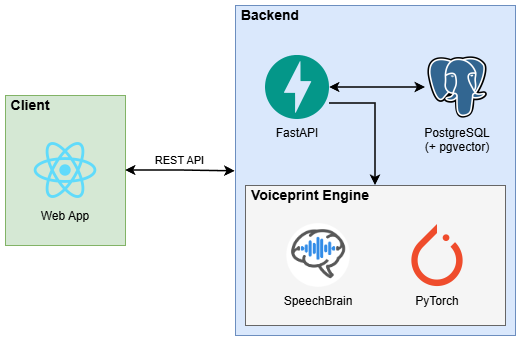
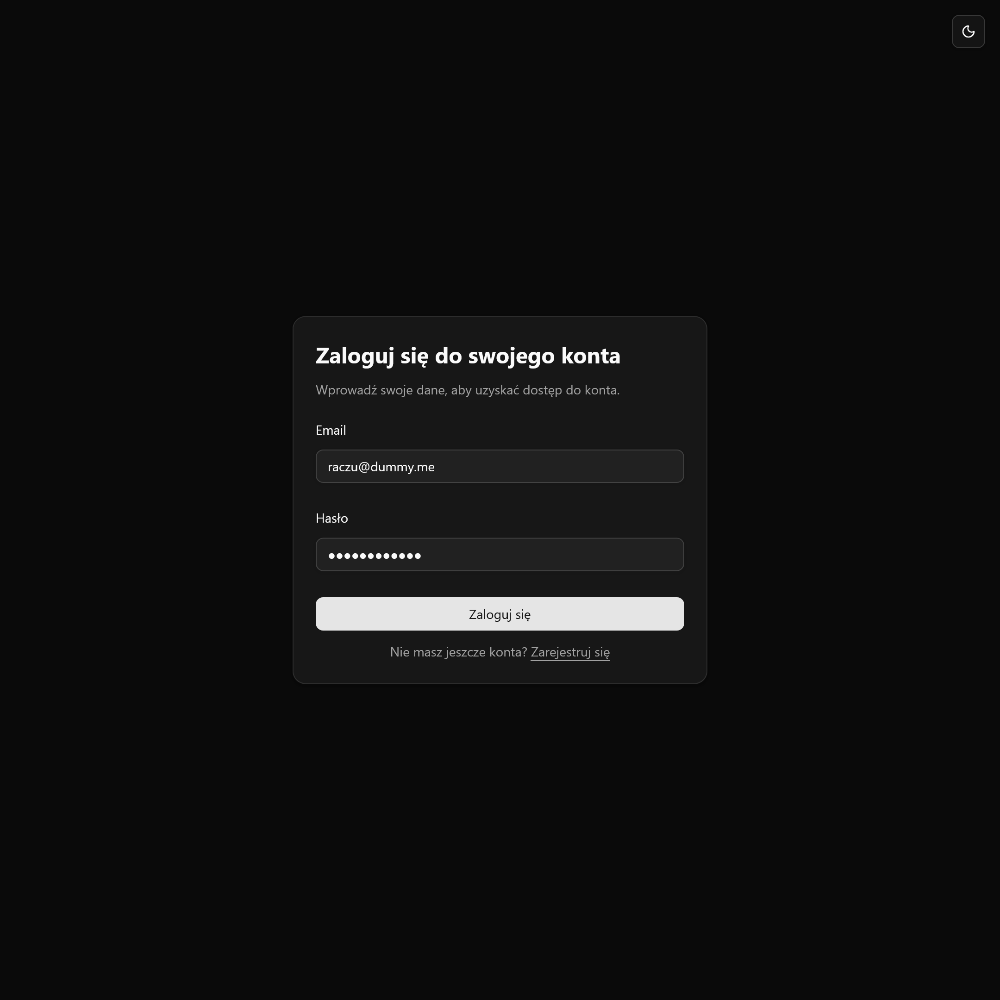
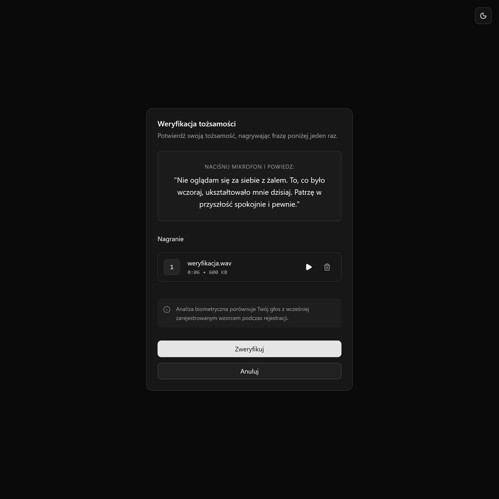
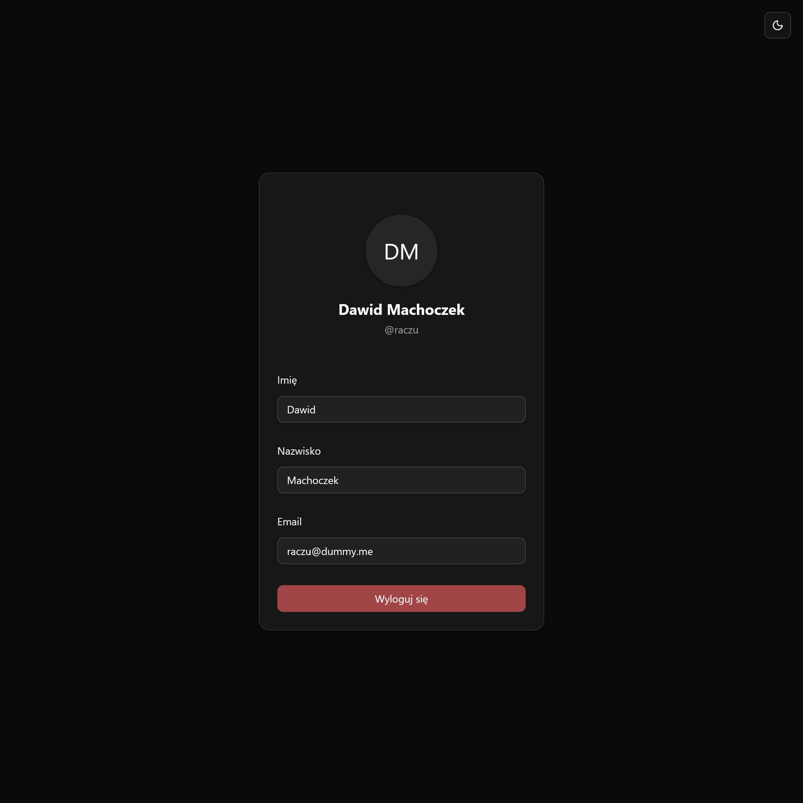
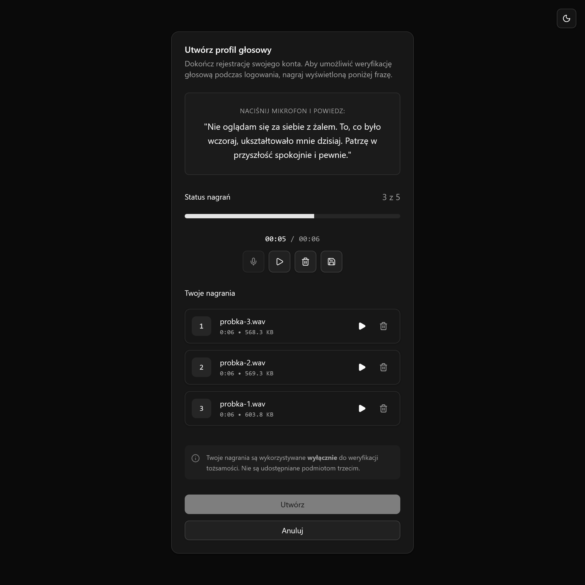

# voiceprint-2fa

`voiceprint-2fa` is a proof-of-concept implementation of a two-factor authentication (2FA) system that utilizes voice
biometrics for securing user access. The primary goal of this project is to evaluate the feasibility of this approach and
determine whether voice-based authentication could be a viable alternative to traditional 2FA methods.

Application comprises a web-based user interface for enrollment and authentication, as well as a backend infrastructure
based on FastAPI and PostgreSQL. For voice biometric processing, the system integrates the speechbrain library for
audio processing and voiceprint generation, whereas pgvector extension is used for storing and querying voice embeddings.

The implementation is experimental and intentionally limited in scope. It is not intended to represent a complete solution,
but rather serves as a technical validation of concept and an exploration of the potential benefits and challenges
associated with voice-based authentication.

*Please refer to the [UI Showcase](#ui-showcase) section for a visual overview of the authentication flow.*

## Architecture

Below is a simplified system architecture diagram detailing the core components, including the web-based interface,
backend, database, and integrated voiceprint engine.

<div align="center">
    
</div>

## Voiceprint processing

The core component of the system is the `VoiceprintEngine`, which uses pretrained models provided by the speechbrain
library for voice biometric processing. PyTorch serves as the underlying machine learning framework, while torchaudio is
used for audio processing tasks. The application support capturing audio samples (WAV format, 16kHz mono) directly
through the web interface.

The backend processing pipeline performs sequential audio preprocessing, including optional Voice Activity Detection
(VAD) and amplitude normalization using either peak or RMS normalization. When it comes to the feature extraction stage,
the system supports two voice embedding models: ECAPA-TDNN and x-vector, both provided by the speechbrain library, and
pretrained on the VoxCeleb dataset.

During the enrollment phase, the system requires five distinct voice samples (configurable), using a randomly selected
phrase from predefined set of authentication phrases, to generate a voiceprint. The resulting embeddings are aggregated
using desired strategy, with arithmetic mean being used by default. Whereas during authentication phase, the system
generates a voice embedding from the provided verification sample and compares it with the stored reference embedding
using cosine similarity.

## Configuration

Both the web client and backend components require proper configuration prior to deployment. All configuration parameters
are defined in the `.env.sample` file located in the root directory, which should be copied to `.env` and updated with
actual values.

The default configuration uses ECAPA-TDNN model for voice embedding generation. Since x-vector model produces embeddings
of different dimensions, switching between models requires updating the corresponding model configuration in
`backend/core/settings.py` and generating a new alembic migration (used for creating appropriate database schema for
storing embeddings).

**NOTE**: Voice embedding models are not interchangeable. Once a model has been used to generate voice embeddings, it is
not possible to switch to another one.

The set of authentication phrases is defined in the `backend/database/seeder.py` and can be changed to suit specific
requirements. These phrases are presented to users during enrollment and subsequently used as a challenge phrases during
authentication.

## Deployment

Deploying the application is straightforward, to deploy whole stack, including web client, backend and database, run
the following command:

```bash
# Make sure to configure the .env file before running this command.
docker compose up --build -up
```

## UI Showcase

Below are screenshots showcasing the voice enrollment and authentication flow. Please note that the entire UI is available
only in Polish.

|                            Login Form                            |                                Voice Verification                                |
|:----------------------------------------------------------------:|:--------------------------------------------------------------------------------:|
|  |  |

|                           Dashboard                            |                               Voice Enrollment                               |
|:--------------------------------------------------------------:|:----------------------------------------------------------------------------:|
|  |  |
